# Life Dashboard Architecture

## Current local architecture

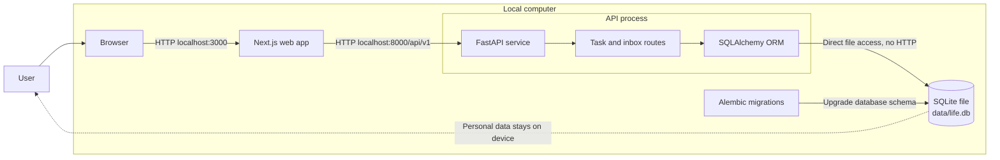

SQLite is embedded. It is not a separate server and does not listen on a network port. FastAPI opens the database file directly through SQLAlchemy.

The browser and FastAPI still communicate over local HTTP because they are separate application processes. That traffic remains on the computer when both services bind to localhost.

## End-to-end agent message lifecycle

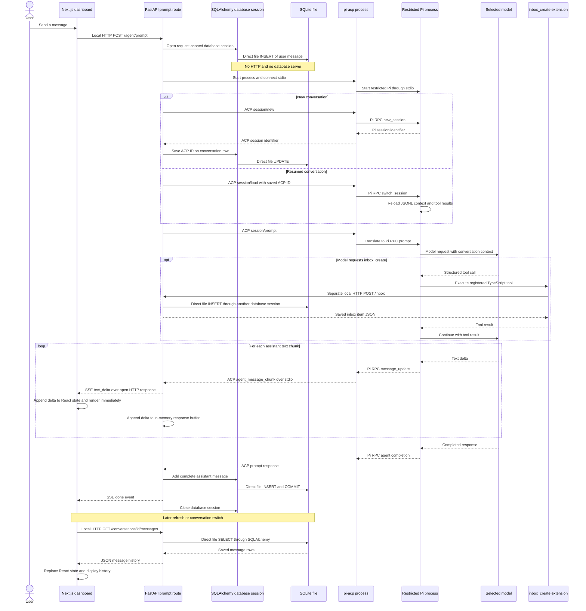

### Transport boundaries

| Connection | Transport | Purpose |
| --- | --- | --- |
| Browser to FastAPI | Local HTTP | API requests, JSON responses, and SSE |
| Life Dashboard extension to FastAPI | Local HTTP | Execute the allowed `inbox_create` application action |
| FastAPI to `pi-acp` | stdin/stdout | ACP JSON-RPC messages and events |
| `pi-acp` to Pi | stdin/stdout | Pi-specific JSON-RPC messages and events |
| FastAPI/SQLAlchemy to SQLite | Direct file access | SQL reads, writes, and transactions; no HTTP |

### Three different meanings of session

| Name | Lifetime | Responsibility |
| --- | --- | --- |
| SQLAlchemy database session | One HTTP request or stream | Temporary unit of work used to read and write SQLite |
| Life Dashboard conversation | Persistent SQLite row | Product-level chat, title, model settings, messages, and ACP ID |
| ACP/Pi agent session | Persistent Pi JSONL context | Full model context, tool calls, tool results, and compaction state |

The parameter `session: SessionDep` in a FastAPI route means a SQLAlchemy database session. It does not mean the ACP/Pi agent session.

## Request and persistence flow

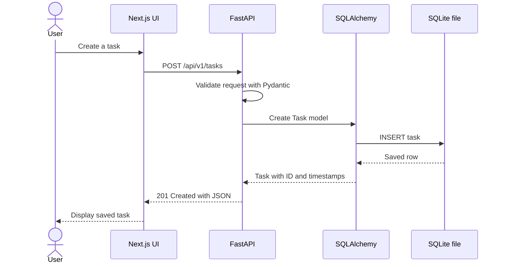

## Application boundaries

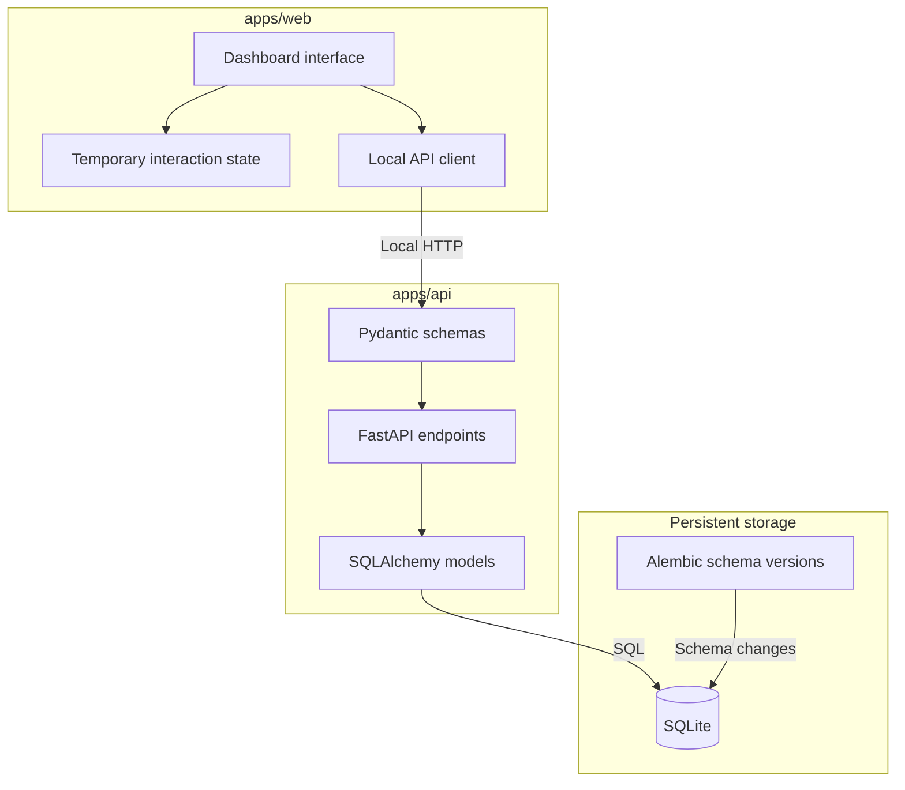

Tasks and inbox captures now use the API client and persist in SQLite. The schedule and approval cards still use sample in-memory data until their backend models are implemented.

## Future Docker deployment

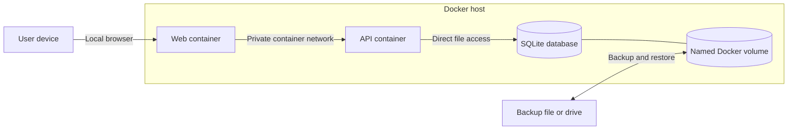

The SQLite file must live in a persistent Docker volume. Containers can then be replaced or upgraded without deleting personal data. A future `compose.yaml` can start both services with one command.

For local-only use, published ports should bind to `127.0.0.1`. If another trusted device needs access over the home network, authentication and transport security should be added before exposing the service.

### Future agent sidecar

The current API starts a temporary `pi-acp` process and restricted Pi process for each agent operation, then closes both when that operation finishes. A future deployment may move those Node.js and Pi dependencies into a long-running companion service or container.

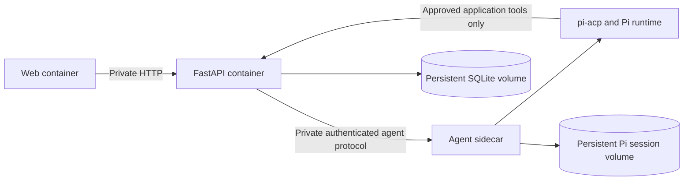

The sidecar could reduce per-prompt startup latency, isolate provider credentials and Node.js dependencies, enforce separate CPU and memory limits, and restart independently. It must remain unable to open SQLite directly. This is a future option rather than a current requirement; its private interface, authentication, concurrency, health checks, and session-volume lifecycle need deliberate design before implementation.

## Future capability roadmap

The detailed roadmap lives in [`future-additions.md`](future-additions.md). Three planned workstreams are intentionally not enabled yet:

1. A dedicated **Autonomous Agents** tab for supervised scheduled and long-running jobs, including budgets, checkpoints, leases, pause/stop controls, approvals, and ledger visibility.
2. Permission-gated **MCP servers** that expose only user-approved tools and resources. MCP complements ACP rather than replacing it: ACP connects agent harnesses, while MCP connects those harnesses to additional tool providers.
3. Repeatable **benchmarks** covering API and SQLite performance, agent startup and streaming, concurrency, indexing and retrieval, sidecar comparisons, tool safety and recovery, resource use, and frontend responsiveness.
4. A user-controlled **People Graph** with separate individual, relationship, group, and owner memory scopes. Every generated memory needs provenance, correction, selective forgetting, and confirmation for sensitive inferences.
5. A read-only-first **Obsidian connector** and a permissioned connector interface for selected external knowledge sources. Imported content remains untrusted data and cannot silently become agent instructions.
6. Optional **voice interaction** beginning with visible push-to-talk, reviewable transcripts, local speech processing where practical, and separate opt-in for cloud speech providers. Raw audio is discarded by default.
7. A **portable encrypted export and backup center** with verified restore, manual archive download/upload, and later scheduled Amazon S3, S3-compatible, local-drive, and supported cloud destinations. See [Future opt-in backup and restore](#future-opt-in-backup-and-restore).

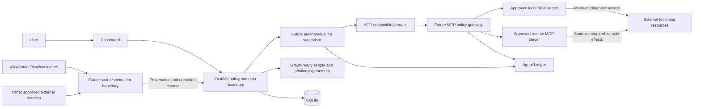

Autonomous jobs, MCP tools, source connectors, voice providers, and backup destinations must remain behind FastAPI-owned policy, approvals, and auditing. No job, harness, sidecar, MCP server, source adapter, or cloud destination may open SQLite directly. Relationship context must remain scoped so one person's private memory is not disclosed in another context by default. Imported notes, messages, pages, and MCP resources are untrusted content rather than executable instructions. Raw voice audio is ephemeral by default, and backup credentials never enter agent context. Benchmark fixtures must use synthetic data and must not upload personal conversation contents.

## ACP agent architecture

ACP is the adapter boundary between Life Dashboard and an interchangeable agent. The agent does not open SQLite directly. FastAPI remains the owner of data access, permissions, auditing, and approvals.

The first integration is implemented with the official Python ACP SDK and a pinned `pi-acp` adapter. A restricted Pi launcher disables built-in tools, global extensions, skills, prompt templates, and context files. It explicitly enables only the project-owned `inbox_create` tool.

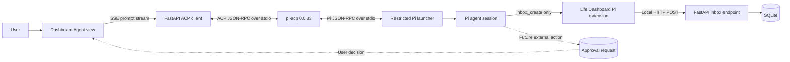

### Current process lifecycle and visibility

For each active prompt, FastAPI starts one `pi-acp` child process. That adapter starts one Pi child process through `life-pi`. The launcher uses `exec`, so it is replaced by Pi and does not remain as a third process.

```text
FastAPI
└── pi-acp
    └── Pi
```

Both agent children close when the prompt completes, times out, fails, or its stream is cancelled. The next prompt starts a new pair and reloads the saved Pi session. Two different conversations may run concurrently and use two independent process pairs. The API rejects a second concurrent run for the same conversation to prevent two processes from writing the same Pi session at once.

Inspect current agent processes on macOS or Linux:

```bash
for pid in $(pgrep -f 'apps/agent/node_modules/.bin/pi-acp'); do
  ps -p "$pid" -o pid,ppid,etime,command
  for child in $(pgrep -P "$pid"); do
    ps -p "$child" -o pid,ppid,etime,command
  done
done
```

Refresh that view once per second until pressing Control-C:

```bash
while true; do
  clear
  date
  for pid in $(pgrep -f 'apps/agent/node_modules/.bin/pi-acp'); do
    ps -p "$pid" -o pid,ppid,etime,command
    for child in $(pgrep -P "$pid"); do
      ps -p "$child" -o pid,ppid,etime,command
    done
  done
  sleep 1
done
```

The World screen polls `GET /api/v1/agent/runs` and represents each active application-level run as a moving agent with its current status, model, and elapsed time. This registry is intentionally ephemeral: it is held in FastAPI memory, clears on restart, and represents the current API worker rather than a persistent audit log.

Example agent flow:

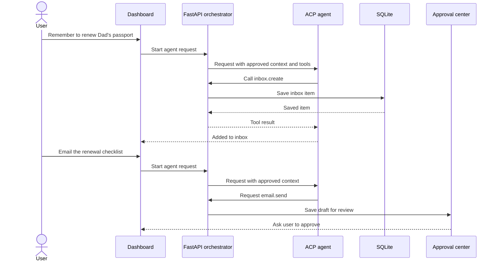

A suggested initial policy is:

| Agent operation | Default policy |
| --- | --- |
| Read explicitly selected tasks or inbox items | Allow for the current request |
| Add an inbox item | Allow and record in an audit log |
| Create a local task | Allow, or make configurable |
| Modify or delete personal records | Ask for confirmation |
| Send email, change a calendar, purchase, or publish | Always require approval |
| Read the SQLite file directly | Never allow |

The ACP prompt stream and `inbox_create` path are implemented. The Agent view also reads Pi's ACP session configuration options, displays the available models and thinking levels, and applies the selected values with ACP `session/set_config_option` before prompting. Conversations and visible messages are stored in SQLite. Each conversation stores its ACP session ID, allowing a later process to call ACP `session/load` and reconnect to Pi's persisted context. The local Agent Ledger records run lifecycle events, selected configuration, tool inputs and outputs provided by ACP, failures, and timestamps. Additional agent tools and approval-backed external actions remain future work.

### Persistent conversation storage

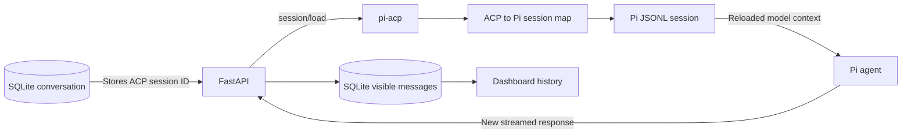

Storage responsibilities:

- `data/life.db` stores conversation titles, selected model and thinking level, ACP session IDs, and messages shown by the dashboard.
- `~/.pi/pi-acp/session-map.json` maps ACP session IDs to Pi session files.
- `~/.pi/agent/sessions/` contains Pi's actual conversation context and tool results.

Deleting or moving Pi's session file prevents ACP context restoration even if the dashboard still has its visible message history. A future cleanup operation should delete both records together.

### Persistent agent ledger

`agent_ledger_entries` is an application-owned, append-oriented audit timeline. FastAPI writes entries at run start, ACP session connection, tool start, tool completion or failure, and terminal run outcome. It intentionally does not write one entry per text chunk.

The ledger can retain metadata after a conversation is deleted because its conversation foreign key uses `ON DELETE SET NULL`. Tool inputs and outputs are bounded before storage and remain local in SQLite. Ledger events currently have no automatic expiration and remain until the user directly removes them or a future retention control is implemented. The current ledger is useful for inspection, but it is not tamper-proof compliance storage because a user with direct file access can modify SQLite.

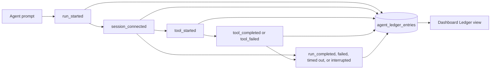

### Future opt-in backup and restore

Life Dashboard remains local-only by default. A future backup service should be explicitly enabled by the user and support interchangeable destinations rather than requiring one cloud vendor.

Potential destinations include:

- Amazon S3 and S3-compatible storage such as Cloudflare R2, Backblaze B2, MinIO, or a NAS gateway
- A user-selected local folder, external drive, or network share
- Optional provider adapters for services such as Google Drive, Dropbox, or iCloud when reliable APIs and credentials are available

A complete conversational backup needs more than `life.db`. It should include a transactionally safe SQLite snapshot, Pi JSONL session files, and the ACP-to-Pi session map. Provider credentials and model API keys should not be included by default.

Backup requirements:

- Encrypt archives before upload, with keys controlled by the user
- Keep cloud backup disabled until the user opts in
- Use versioned snapshots and configurable retention
- Verify checksums after upload and before restore
- Avoid copying a live SQLite file directly; use SQLite's backup API or another consistent snapshot mechanism
- Restore into a staging location, validate it, then run required Alembic migrations
- Record backup and restore operations in the local ledger without storing cloud secrets

This backup layer is future work and is separate from the possible agent sidecar. Agents must not receive cloud credentials or direct access to backup storage.

## Database migrations

A migration is a versioned instruction that changes the structure of an existing database safely and predictably.

Examples include:

- Creating the `tasks` table
- Adding a `due_at` column
- Creating an index
- Renaming a field
- Moving existing values into a new structure

Migrations are needed because changing a SQLAlchemy model does not automatically update databases that already exist.

### Migration flow

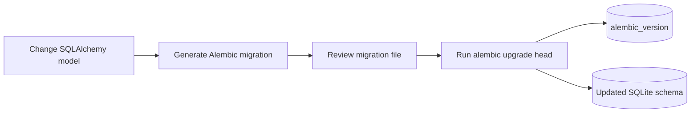

Alembic stores the currently applied revision in a small `alembic_version` table inside SQLite. It compares that revision with the migration files and applies only the missing changes in order.

The first migration in this project is:

```text
apps/api/migrations/versions/02735e6dcdd2_create_tasks_and_inbox_items.py
```

It creates the initial `tasks` and `inbox_items` tables. The next migration is:

```text
apps/api/migrations/versions/53e64731bb36_add_persistent_agent_conversations.py
```

It adds `agent_conversations` and `agent_messages` for resumable dashboard conversations. The ledger migration is:

```text
apps/api/migrations/versions/50d8f5c89bed_add_persistent_agent_ledger.py
```

It adds the persistent `agent_ledger_entries` audit timeline.

Each migration contains:

- `upgrade()`: creates the tables when moving forward
- `downgrade()`: removes the tables when intentionally rolling back

Do not run the initial downgrade on a database containing important data because dropping those tables deletes their rows.

### Commands

Apply every pending migration:

```bash
cd apps/api
uv run alembic upgrade head
```

Check whether model changes need a new migration:

```bash
uv run alembic check
```

Generate a migration after changing models:

```bash
uv run alembic revision --autogenerate -m "describe the change"
```

Autogenerated migrations must be reviewed before they are applied. Alembic can detect many schema changes, but it cannot always infer the intended data transformation.

Show the migration history and current database revision:

```bash
uv run alembic history
uv run alembic current
```

Roll back one revision:

```bash
uv run alembic downgrade -1
```

Back up `data/life.db` before destructive migrations or rollbacks. In Docker, back up the database from the persistent volume.
